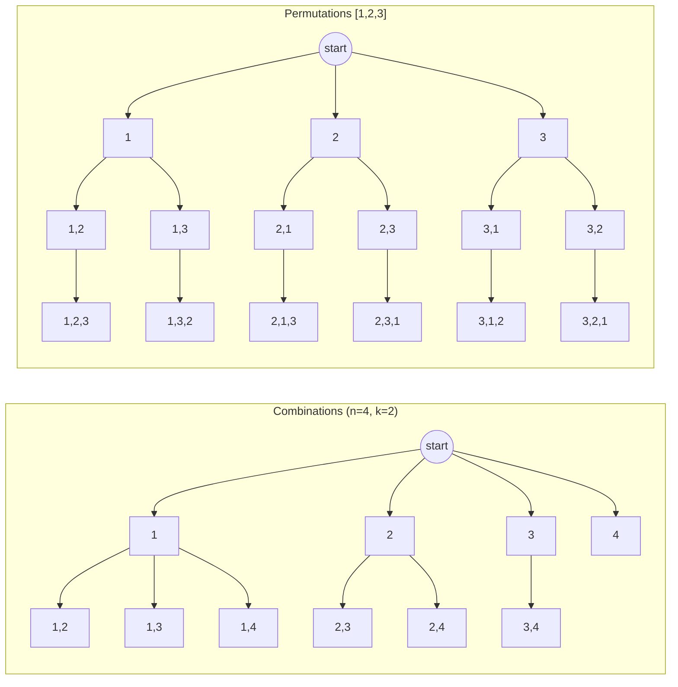
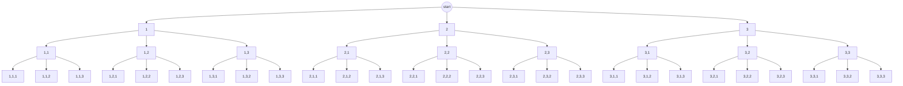

<h1 align="center">Learn Recursion</h1>

learning recursion to increase my chances of solving any DSA question encountered in interviews (-_-)

### [🌸 Everything All At Once (～￣▽￣)～](./EVERYTHING_ALL_AT_ONCE.md)

## Day 1
> 19 Dec, 2025

- [x] print increasing
- [x] print decreasing
- [x] print increasing-decreasing
- [x] factorial
- [x] linear-power-x-n
- [x] logarithmic-power-x-n

## Day 2
> 20 Dec, 2025

- [x] print zig-zag (pre-in-post)
- [x] tower-of-hanoi
- [x] print array element
- [x] print array element in reverse
- [x] max array element
- [x] first index of occurance in array
- [x] last index of occurance in array

## Day 3
> 21 Dec, 2025

- [x] all indices in array
- [x] get subsequence
- [x] get keypad combination
- [x] get stair path
- [x] stair path base helper (for explaining `base` case of `get-stair-path`)

## Day 4
> 22 Dec, 2025

- [x] get maze path
- [x] get maze path with jump
- [x] print subsequence
- [x] print keypad combination
- [x] print stair path
- [x] print maze path

## Day 5
> 23 Dec, 2025 || solved first 3 on 25 Dec, 2025

> [!NOTE]  
> I’ll solve the remaining problems after my university exam (-_-)

- [x] print maze path with jump
- [x] print permutation
- [x] print encoding
- [ ] ~~flood fill~~
- [ ] ~~target sum subsets~~
- [ ] ~~n queens~~
- [ ] ~~knight tour~~

## Day 6
> 31 March, 2025

- [x] flood fill
- [x] target sum subsets
- [x] n queens
- [x] knight tour


## Visualization Diagram

<details>
<summary> Permutation & Combination </summary>
<h3 align="center"> ⚡ Permutation & Combination </h3>



### if used[i] not used



### CPP code 

```cpp
// COMBINATION
#include <bits/stdc++.h>
using namespace std;

class Solution {
public:
    vector<vector<int>> result;

    void backtrack(int start, int n, int k, vector<int>& path) {
        if (path.size() == k) {
            result.push_back(path);
            return;
        }

        for (int i = start; i <= n; i++) {
            path.push_back(i);               // choose

            backtrack(i + 1, n, k, path);   // move forward

            path.pop_back();                // un-choose
        }
    }

    vector<vector<int>> combine(int n, int k) {
        vector<int> path;
        backtrack(1, n, k, path);
        return result;
    }
};


// PERMUTATION
#include <bits/stdc++.h>
using namespace std;

class Solution {
public:
    vector<vector<int>> result;

    void backtrack(vector<int>& nums, vector<int>& path, vector<bool>& used) {
        if (path.size() == nums.size()) {
            result.push_back(path);
            return;
        }

        for (int i = 0; i < nums.size(); i++) {
            if (used[i]) continue;

            used[i] = true;              // choose
            path.push_back(nums[i]);

            backtrack(nums, path, used);

            path.pop_back();             // un-choose
            used[i] = false;
        }
    }

    vector<vector<int>> permute(vector<int>& nums) {
        vector<int> path;
        vector<bool> used(nums.size(), false);
        backtrack(nums, path, used);
        return result;
    }
};

```

</details>